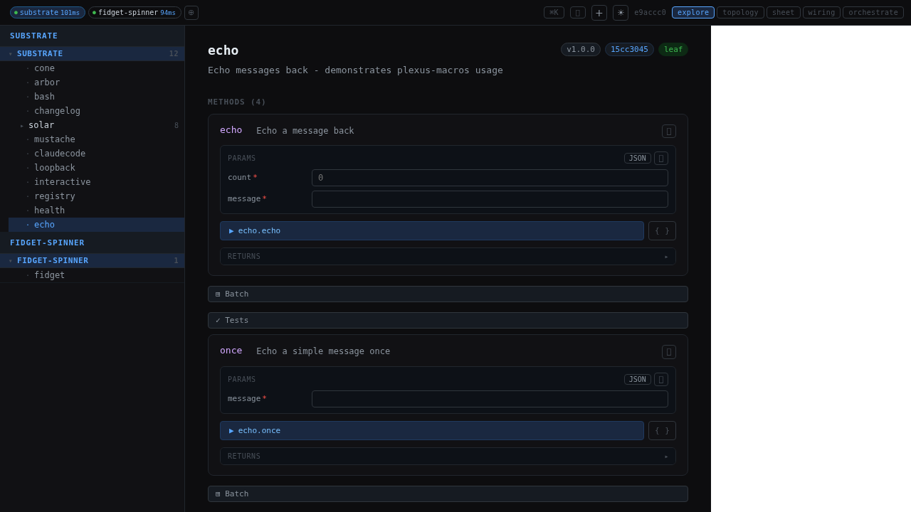
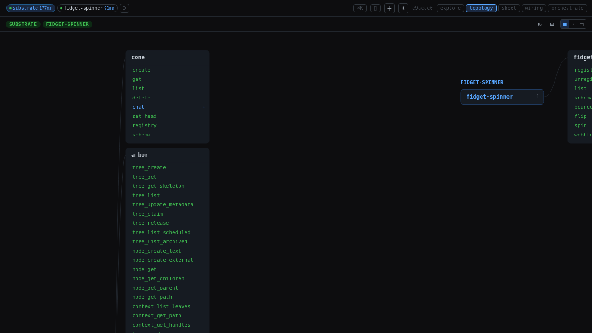
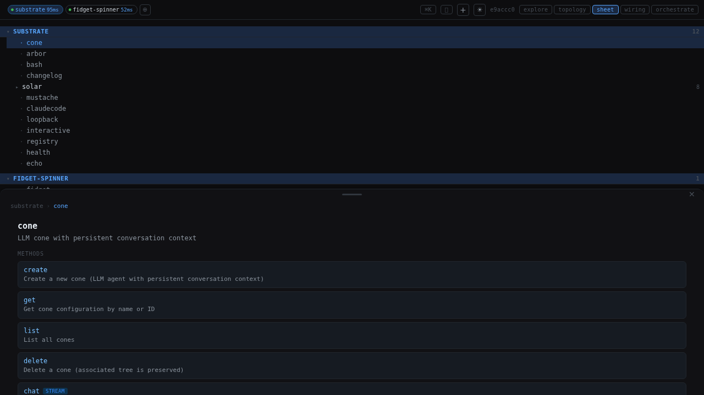
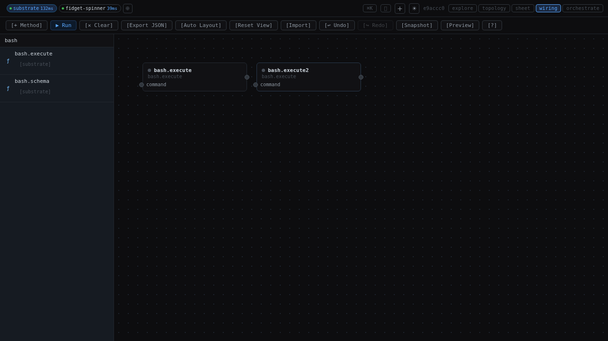

# plexus-gamma

**Swagger UI for your microservices — but generated at runtime from live schema, not a YAML file.**

<p align="center">
  
  
</p>
<p align="center">
  
  
</p>

---

## What is it?

plexus-gamma is a browser-based explorer for services that speak
[plexus-rpc](https://github.com/hypermemetic/plexus) — a JSON-RPC 2.0 protocol over
WebSocket where every service self-describes its API at runtime.

**It works like Swagger UI, but:**

| Swagger UI | plexus-gamma |
|---|---|
| Reads a static `openapi.yaml` committed to the repo | Fetches live schema from the running service at startup |
| Needs a rebuild when the API changes | Auto-refreshes when the service schema hash changes |
| Knows about one service at a time | Connects to multiple backends simultaneously |
| Can't actually run streaming RPC calls | Streams results in real time, renders line by line |
| API changes require updating docs | Zero docs — the service is its own documentation |

**New microservices integrate with zero code changes.** Point plexus-gamma at a new
`ws://host:port` and it immediately discovers every plugin, namespace, method, parameter
schema, and description from the live service. No config files, no code generation, no
restarts.

---

## Views

| Tab | What it does |
|-----|--------------|
| **explore** | Tree of all connected backends. Click a plugin → see its schema and methods. Click a method → fill params and invoke live. Results stream in real time. |
| **topology** | Canvas graph — backends as nodes, plugins as children. Drag, zoom, compare backend structures visually. |
| **sheet** | All backends side by side. Click any leaf node to slide up a detail sheet with the full method list. |
| **wiring** | Visual pipeline builder. Drag methods onto a canvas, wire outputs to inputs, run the whole pipeline in one click. |
| **orchestrate** | Workflow editor for sequencing steps with branching logic and reusable workflow definitions. |

---

## The plexus-rpc schema system

Every plexus-rpc service exposes a **self-describing, hierarchical schema** — no external
registry or service mesh required.

```
ws://host:port
  ├─ service.schema()     → root namespace schema
  ├─ service.hash()       → content hash of the whole schema tree
  ├─ plugin.schema()      → child namespace schema
  └─ plugin.method()      → actual RPC call (streaming)
```

A schema node describes:
- **namespace** — dot-namespaced identifier (`echo`, `solar.earth`)
- **version** — semver string
- **hash** — stable content hash (changes when methods or children change)
- **description** / **long_description** — human-readable, rendered directly in the UI
- **methods** — array of `{ name, description, streaming, bidirectional, params, returns }`
  where `params` and `returns` are JSON Schema objects
- **children** — sub-namespaces (recursive tree)

plexus-gamma walks this tree on connect, caches it, and polls `service.hash()` every few
seconds. When the hash changes (a new plugin registered, a method signature updated) the
affected subtree is re-fetched and the UI updates — no page reload.

**This is why zero-config integration works:** a new microservice that implements the
protocol is immediately visible in the explorer. If it registers itself into another
service's `registry` plugin (which plexus-gamma understands natively), it even appears
automatically without the user adding a connection manually.

---

## Zero-config microservice integration

```
1. Start a new plexus-rpc service (any language — substrate/Rust, synapse/Haskell, etc.)
2. It calls registry.register() on the hub
3. plexus-gamma sees the registry.list() response change
4. New backend appears in the sidebar, all plugins browsable, all methods invokable
   — with no changes to plexus-gamma, no config updates, no restarts
```

plexus-gamma also exposes itself as a plexus-rpc backend on `:44707`, so external scripts
and other services can drive the live UI over WebSocket:

```jsonc
// navigate the live browser to wiring view
{ "jsonrpc": "2.0", "id": 1, "method": "plexus-gamma.call",
  "params": { "method": "ui.navigate", "params": { "view": "wiring" } } }
```

---

## Getting started

```bash
bun install
bun run dev          # Vite (:8081) + Bun RPC server (:44707)
```

Connect a backend from the `+` button in the header bar, or set the `VITE_DEFAULT_BACKEND`
env var. The default config connects to `ws://127.0.0.1:4444` (substrate).

```bash
bun run test         # 155 Playwright functional tests
bun run screenshots  # re-capture docs/screenshots/ and update README images
```

---

## Codegen pipeline

plexus-gamma's TypeScript client files (`types.ts`, `rpc.ts`, `transport.ts`) are
generated by the synapse-cc / hub-codegen toolchain — not hand-written.

### High level

```
synapse.config.json  →  synapse-cc build  →  src/lib/plexus/{types,rpc,transport}.ts
```

The target config specifies `typescript`, `browser` transport (native WebSocket, no
Node.js `ws` package), and `--generate transport` (no IR fetch needed — purely static).

### synapse-cc pipeline (`Pipeline.hs`)

1. **generateCode** — calls `hub-codegen --output-format json --generate transport
   --transport browser`. Parses stdout JSON into `CodegenOutput { files, dependencies,
   devDependencies }`. No backend connection needed.
2. **applyMerge** (`Merge.hs`) — three-way merge: `(baseline, generated, current on disk)`.
   Files the user hasn't touched are overwritten; user-modified files are skipped with a
   warning. `package.json` is excluded.
3. **addDependencies** / **installDependencies** (`Language.hs`) — runs `bun add` /
   `bun add -D` for deps from `CodegenOutput`, then `bun install`.
4. **writeCache** — writes `synapse.lock` keyed by output dir, stores `irHash` and file
   content hashes for incremental rebuilds.

### hub-codegen transport generation (`generator/typescript/`)

With `--generate transport --transport browser`:
- `types.ts` — all `PlexusStreamItem` variants (`content`, `done`, `error`) + `StreamMetadata`
- `rpc.ts` — `PlexusRpcClient`: connects over WebSocket, sends JSON-RPC 2.0
  `{method:"backend.call", params:{method, params}}`, receives a `subscriptionId`,
  then consumes `subscription` notifications as an `AsyncGenerator<PlexusStreamItem>`
- `transport.ts` — `browser` variant: native `WebSocket`, no `import WebSocket from 'ws'`,
  tsconfig `"lib": ["ES2022", "DOM"]`

The `--output-format json` flag makes hub-codegen write `CodegenOutput` JSON to stdout
(no file writes), which synapse-cc reads from the child process's stdout pipe.

### plexus-rpc wire protocol (what `rpc.ts` implements)

```
Client → { jsonrpc:"2.0", id:N, method:"backend.call",
           params:{ method:"ns.method", params:{...} } }

Server → { id:N, result: <subscriptionId> }           ← immediate ACK
Server → { method:"subscription",
           params:{ subscription:<id>,
                    result:{ type:"content"|"done"|"error", ... } } }  ← stream
```

Every item carries `StreamMetadata { provenance, plexusHash, timestamp }`.
The generator is `AsyncIterable` — consuming code calls `for await (const item of rpc.call(...))`.

### Transport variants

| Flag | WebSocket import | tsconfig | npm dep |
|------|-----------------|----------|---------|
| `--transport browser` | none (native `WebSocket`) | `"lib": ["ES2022", "DOM"]` | none |
| `--transport ws` | `import WebSocket from 'ws'` | `"types": ["node"]` | `ws` |
| `--transport none` | not generated | — | `@plexus/rpc-client: workspace:*` |

---

## Architecture

```
Browser (Vue :8081)                     Bun server (:44707)
  App.vue                                 plexus-rpc protocol
    useBackends()  ──poll hash──▶         _info, schema, call
    useDispatch()  ──invoke─────▶         bridge → browser
    useBridge()    ◀──WS /bridge──        dispatches to Vue
                                          useDispatch()
```

See [`docs/architecture/`](docs/architecture/) for detailed design notes.
