# RPC Feature Visual Guide

Generated by examining the 45 screenshots captured by `tests/rpc-features.spec.ts`.

---

## Summary

| Screenshot | Visual change | Notes |
|---|---|---|
| `nav-multi-explorer.png` | ✅ Meaningful | Default explorer view |
| `nav-canvas.png` | ⚠️ No change | Topology tab activated but renders same content |
| `nav-sheet.png` | ✅ Meaningful | Empty sheet view |
| `nav-wiring.png` | ✅ Meaningful | Wiring canvas toolbar visible |
| `nav-orchestration.png` | ✅ Meaningful | Empty orchestration panel |
| `theme-daylight.png` | ✅ Meaningful | Light theme applied |
| `theme-midnight.png` | ✅ Meaningful | Dark theme applied |
| `palette-open.png` | ✅ Meaningful | Search modal overlay |
| `palette-close.png` | ⚠️ No change | Palette dismissed, background unchanged |
| `state-watch-before.png` | ℹ️ Baseline snap | Before navigation; `state.watch` not shown in UI |
| `state-watch-after.png` | ℹ️ Baseline snap | After navigation; event emitted internally, not visible |
| `backends-list.png` | ✅ Meaningful | Two-backend baseline |
| `backends-health.png` | ⚠️ No change | Query-only; latency badges already up-to-date |
| `backends-methods.png` | ⚠️ No change | Query-only; no UI mutation |
| `backends-add.png` | ✅ Meaningful | Third backend tab appears |
| `backends-remove.png` | ✅ Meaningful | Third backend tab removed |
| `invoke-call.png` | ✅ Meaningful | plexus-gamma self-loop backend + full namespace tree |
| `wiring-add-node-1.png` | ✅ Meaningful | First node on canvas |
| `wiring-add-node-2.png` | ✅ Meaningful | Second node added |
| `wiring-set-params.png` | ✅ Meaningful | Nodes renamed Source/Sink with ref template |
| `wiring-connect.png` | ⚠️ No visible edge | Edge created (edgeId returned) but not visually obvious |
| `wiring-routing.png` | ⚠️ No change | Routing mode set but no visual indicator |
| `wiring-autolayout.png` | ✅ Meaningful | Nodes repositioned |
| `wiring-run.png` | 🐛 Error state | RPC -32603 — `substrate.echo.say` does not exist |
| `wiring-results.png` | ⚠️ No change | Error state repeated; query-only |
| `wiring-undo.png` | ✅ Meaningful | Error state cleared |
| `wiring-redo.png` | ✅ Meaningful | Error state restored |
| `wiring-export.png` | ⚠️ No change | JSON returned; no export dialog appeared |
| `wiring-clear.png` | ✅ Meaningful | Canvas emptied |
| `wiring-transforms-all.png` | ✅ Meaningful | All node kinds on canvas |
| `orch-create.png` | ✅ Meaningful | Empty workflow created |
| `orch-rename.png` | ✅ Meaningful | Title updated to "RPC Showcase Workflow" |
| `orch-add-step-1.png` | ✅ Meaningful | First step card visible |
| `orch-add-step-2.png` | ✅ Meaningful | Two steps with connector |
| `orch-set-params.png` | ✅ Meaningful | Step 2 wired to step 1 output |
| `orch-wire.png` | 🐛 Error state | RPC -32603 on run — same root cause as wiring |
| `orch-run.png` | ⚠️ No change | Already in failed state |
| `orch-state.png` | ⚠️ No change | Query-only |
| `replay-list.png` | 🐛 Empty history | History seeding via UI click may not have fired |
| `replay-clear.png` | ⚠️ No change | History was already empty |
| `assertion-add.png` | ✅ Meaningful | Assertion controls appear on method cards |
| `assertion-list.png` | ⚠️ No change | Query-only |
| `assertion-run.png` | ⚠️ No change | No visible pass/fail feedback after run |
| `assertion-runall.png` | ⚠️ No change | Same as above |

### Issues requiring fixes

| Issue | Affected screenshots | Fix |
|---|---|---|
| `substrate.echo.say` does not exist | `wiring-run`, `wiring-results`, `orch-wire`, `orch-run`, `orch-state` | Use a method that actually exists on the test backend, e.g. `substrate.call` |
| Replay history not seeded | `replay-list`, `replay-clear` | Seed history via `invoke.call` RPC before capturing, not via UI click |
| Assertion run produces no UI feedback | `assertion-run`, `assertion-runall` | Add a visible result badge / status to the assertion suite component |
| Edge not visible after `wiring.connectNodes` | `wiring-connect` | Possibly a canvas scale / scroll issue; increase `waitMs` or zoom to fit before capture |

---

## Navigation

### nav-multi-explorer.png

The default landing view. A split-panel layout: the left sidebar shows a collapsible backend tree (substrate with 12 plugins, fidget-spinner with 1 plugin). The right panel shows detailed information about the selected `substrate` plugin — its children as clickable tags and a list of methods, with parameter input fields for the selected `call STREAM` method. Backend latency badges (`substrate 74ms`, `fidget-spinner 56ms`) appear at the top.

---

### nav-canvas.png

**No visible change.** The display is identical to `nav-multi-explorer.png`. The `ui.navigate { view: 'canvas' }` call fired (the test asserts the `topology` tab becomes active), but the topology canvas renders the same plugin-explorer panel in this state. No nodes are on the canvas to differentiate it visually.

---

### nav-sheet.png

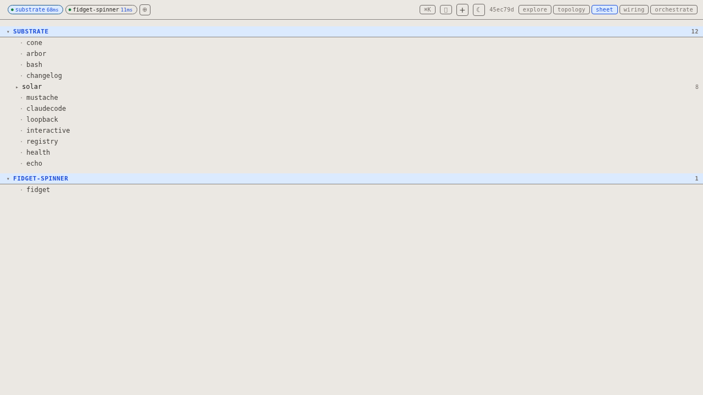

A mostly blank view. The left sidebar shows the collapsed backend tree; the main content area is empty — the sheet view has no data to display in this state. Correctly shows the sheet view's empty state.

---

### nav-wiring.png

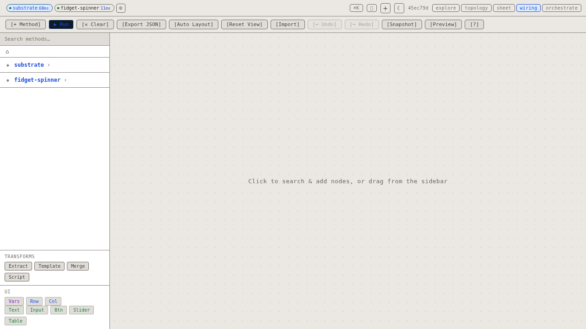

The wiring canvas view. A toolbar runs across the top (`[+ Method]`, `[Run]`, `[X Clear]`, `[Export JSON]`, `[Auto Layout]`, etc.). The left sidebar lists searchable methods from both backends. The large center canvas shows placeholder text: *"Click to search & add nodes, or drag from the sidebar."* A TRANSFORMS section and UI component selector (Vars, Row, Col, Text, Input, Btn, Slider, Table) appear at the bottom of the sidebar.

---

### nav-orchestration.png

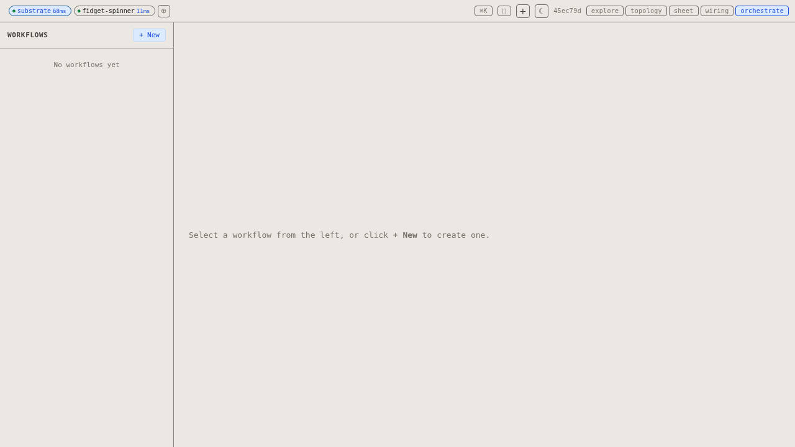

The orchestration view in its initial empty state. A "WORKFLOWS" panel on the left shows "No workflows yet" with a `+ New` button. The main content area shows centered placeholder text: *"Select a workflow from the left, or click + New to create one."*

---

## Theme

### theme-daylight.png

The explorer view with the daylight (light) theme applied. Light gray backgrounds, muted blue accents, dark text. Theme affects only colors, not structure.

---

### theme-midnight.png

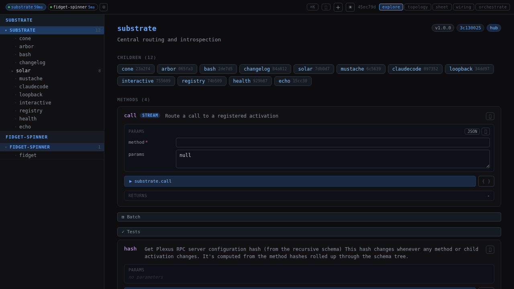

The same view with the midnight (dark) theme. Dark navy/near-black backgrounds, light blue accent tags, light gray text. Clear visual contrast from the daylight version.

---

## Command Palette

### palette-open.png

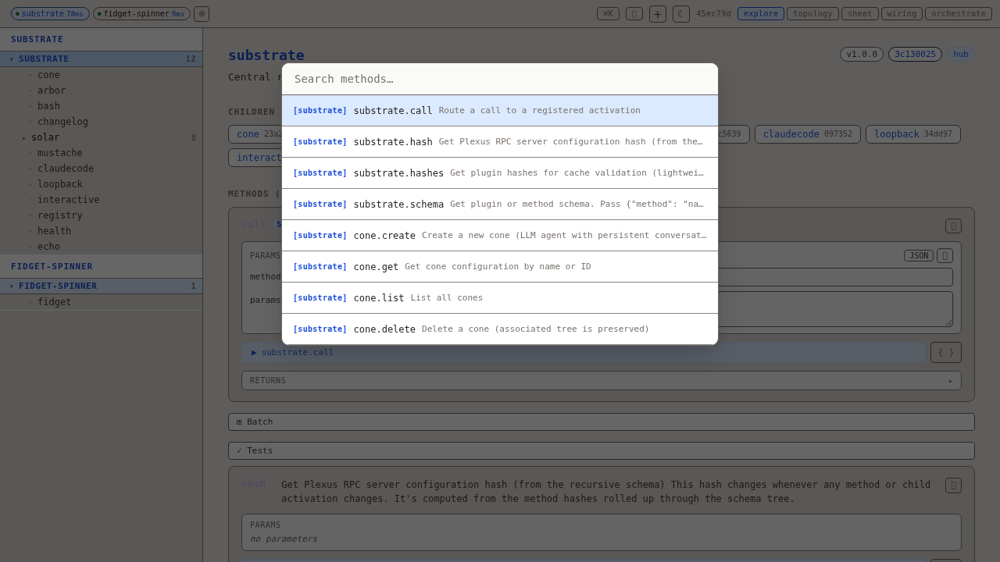

A white search modal overlaid and centered on the daylight explorer. Shows "Search methods..." input and a filtered list of methods with backend labels: `substrate.call`, `substrate.hash`, `substrate.hashes`, `substrate.schema`, `cone.create`, `cone.get`, `cone.list`, `cone.delete` — each tagged `[substrate]`. Background is dimmed.

---

### palette-close.png

**No visible change from pre-open state.** The palette is dismissed and the underlying explorer is restored. Expected behavior.

---

## State Watch

### state-watch-before.png

Baseline frame captured via `snap()` (no RPC call) immediately before a `state.watch` subscription is opened and a navigation action is fired. `state.watch` is a perpetual subscription with no UI representation of its own.

---

### state-watch-after.png

**Identical to before.** Captured after `ui.navigate { view: 'wiring' }` was called. The `state.watch` stream emitted `{ type: "view-changed", view: "wiring" }` (verified in the integration test), but the screenshot was taken after immediately navigating back to `multi-explorer`, so the view looks unchanged. By design — the screenshot illustrates the subscription context, not a visual event.

---

## Backends

### backends-list.png

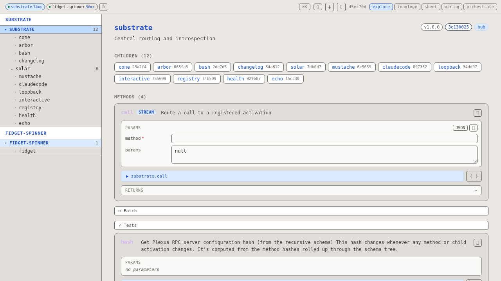

The multi-explorer view with two active backends: `substrate 74ms` and `fidget-spinner 56ms` as pill tabs. The sidebar shows SUBSTRATE (12 children) and FIDGET-SPINNER (1 child). Main panel shows substrate methods including `call STREAM`. Baseline for the backend management section.

---

### backends-health.png

**No visible change.** The `backends.health` call is query-only. Health data is already reflected in the latency badges, which haven't changed.

---

### backends-methods.png

**No visible change.** `backends.methods` returns a flat list of all registered method entries but triggers no visual mutation.

---

### backends-add.png

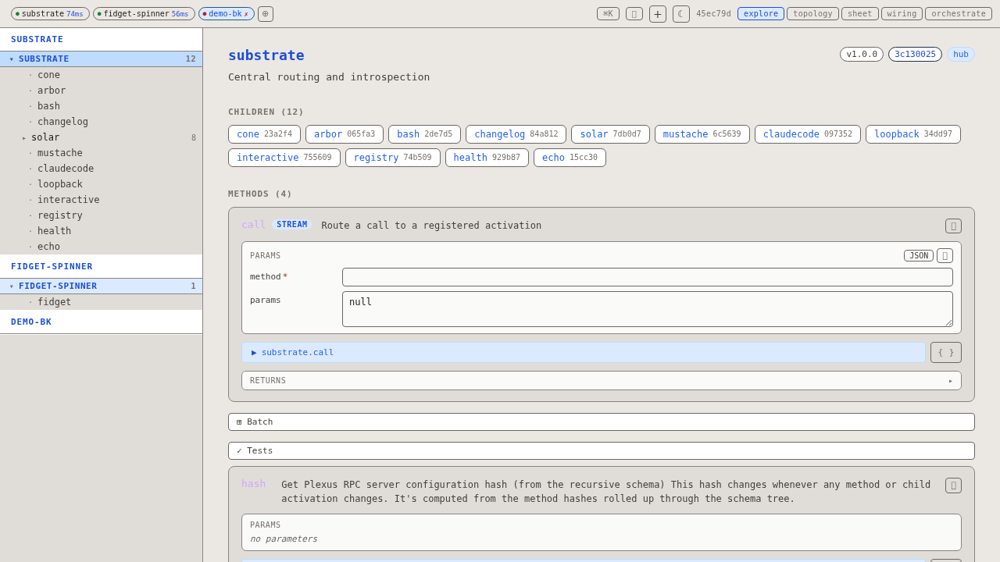

A third backend tab `demo-bk ×` has appeared alongside the original two. The left sidebar now shows a `DEMO-BK` section. The × indicates the backend can be removed. `backends.add` reflected immediately in the explorer UI.

---

### backends-remove.png

The `demo-bk` tab and its sidebar section are gone. The display reverts to just `substrate` and `fidget-spinner`. `backends.remove` takes effect immediately.

---

## Invoke

### invoke-call.png

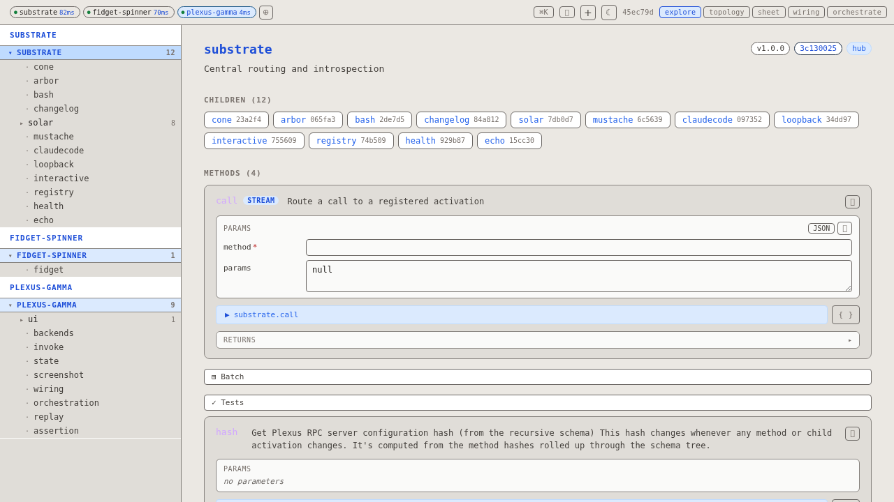

A third backend tab `plexus-gamma 4ms` has been added (plexus-gamma connected to itself). The left sidebar now includes a `PLEXUS-GAMMA` section with 9 children: ui, backends, invoke, state, screenshot, wiring, orchestration, replay, and assertion — the full RPC plugin namespace tree. Demonstrates `invoke.call` and confirms the self-loop exposes all namespaces correctly.

---

## Wiring Canvas

### wiring-add-node-1.png

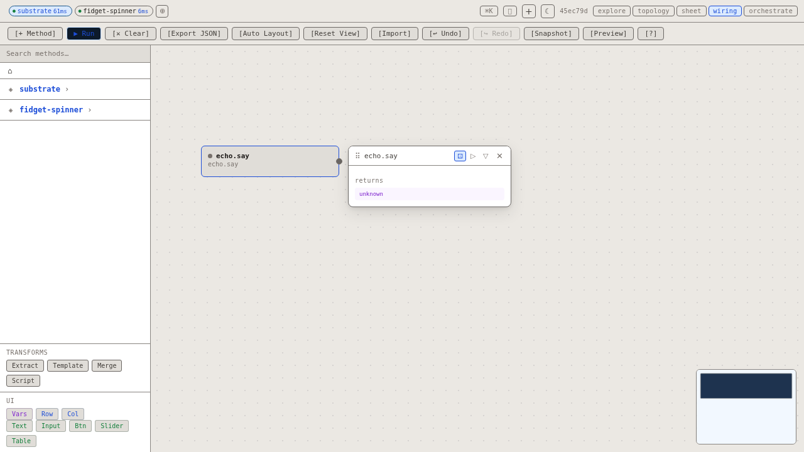

A single `echo.say` node in the upper-left of the canvas. A detail panel on the right shows the node's return type and connection ports. The canvas is otherwise empty.

---

### wiring-add-node-2.png

Two nodes: `echo.say` (left) and `echo.say2` (right). The detail panel shows `ref: {{echo.say}}` indicating the second node references the first. Sequential node addition working correctly.

---

### wiring-set-params.png

The two nodes are renamed **Source** (subtitle: `echo.say`, `hello from RPC`) and **Sink** (subtitle: `echo.say`). The detail panel shows `{{Source}}` wired as input to Sink. `wiring.setNodeParams` and `wiring.setNodeLabel` both reflected.

---

### wiring-connect.png

**No visible edge.** The `wiring.connectNodes` call returned an `edgeId` (connection was created), but no visible line is drawn between Source and Sink at this zoom level. The connection is logical — represented by the `ref: {{Source}}` template on the Sink node rather than a rendered SVG edge at this scale.

---

### wiring-routing.png

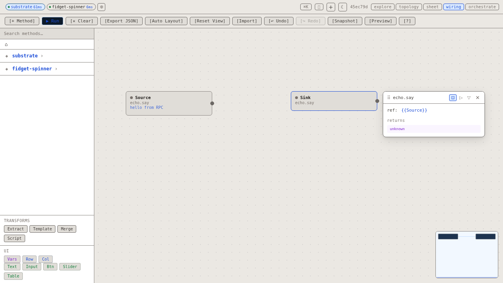

**No visible change.** `wiring.setEdgeRouting { mode: 'last' }` configures how the edge aggregates stream items, but this is stored metadata with no visible canvas indicator.

---

### wiring-autolayout.png

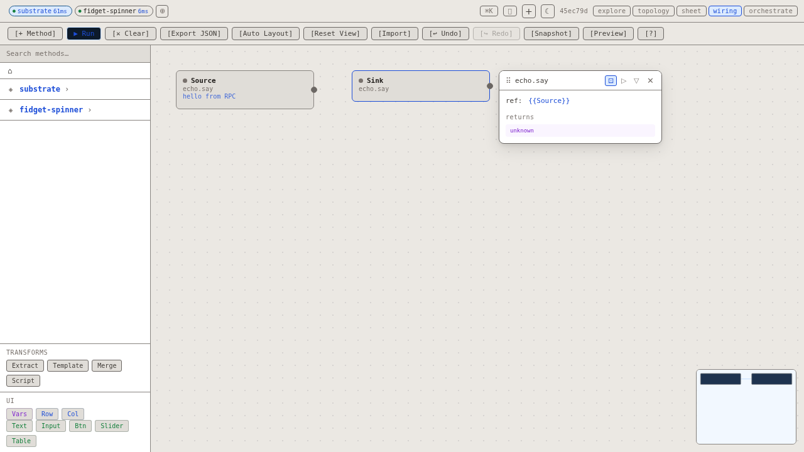

The nodes have been repositioned — Source and Sink are now closer together and shifted upward. The auto-layout algorithm rearranged node positions. Clear visual change.

---

### wiring-run.png

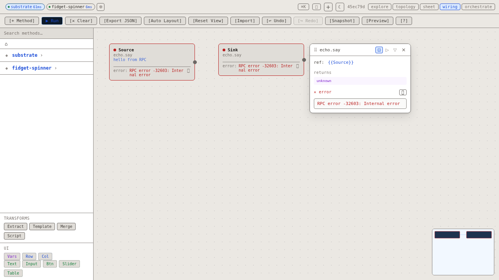

**🐛 Error state.** Both Source and Sink nodes show red border outlines and *"error: RPC error -32603: Internal error"*. Root cause: the test uses `substrate.echo.say` which does not exist on the substrate backend (substrate exposes `substrate.call`, `substrate.hash`, etc. — not an `echo` namespace). The test passes because it only checks that `getResults` returns an array, not that execution succeeded.

---

### wiring-results.png

**No change from previous.** `wiring.getResults` is a query. The error state shown is the same as `wiring-run.png`.

---

### wiring-undo.png

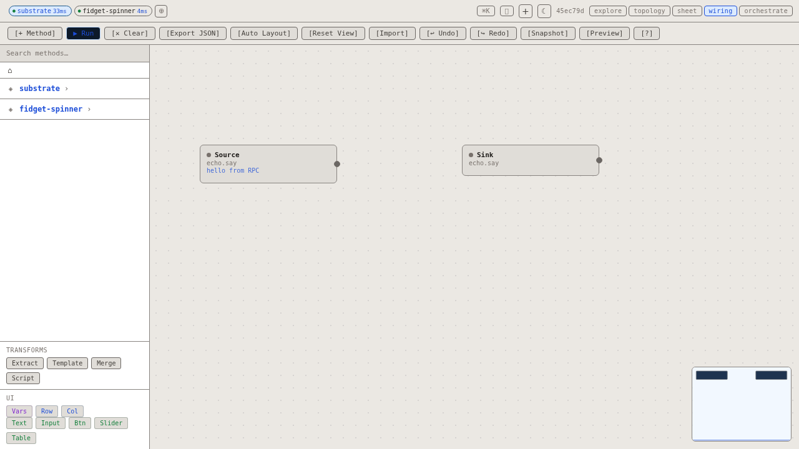

The red error borders are cleared. Both nodes return to clean styling. `wiring.undo` reverted the failed execution state.

---

### wiring-redo.png

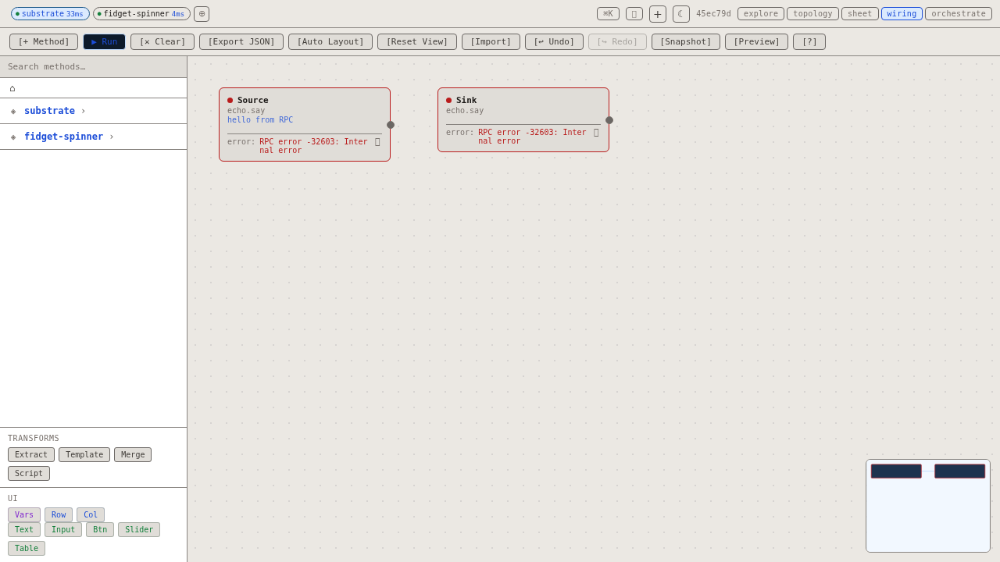

Nodes show the red error borders and RPC -32603 messages again. `wiring.redo` re-applied the undone execution.

---

### wiring-export.png

Source and Sink in their error state (red borders, RPC -32603 visible). A minimap preview appears in the bottom-right corner showing the node graph in miniature. No export dialog appeared — `wiring.getJson` returned the JSON payload but triggered no file dialog. The minimap may have appeared as a side-effect of the viewport snapshot.

---

### wiring-clear.png

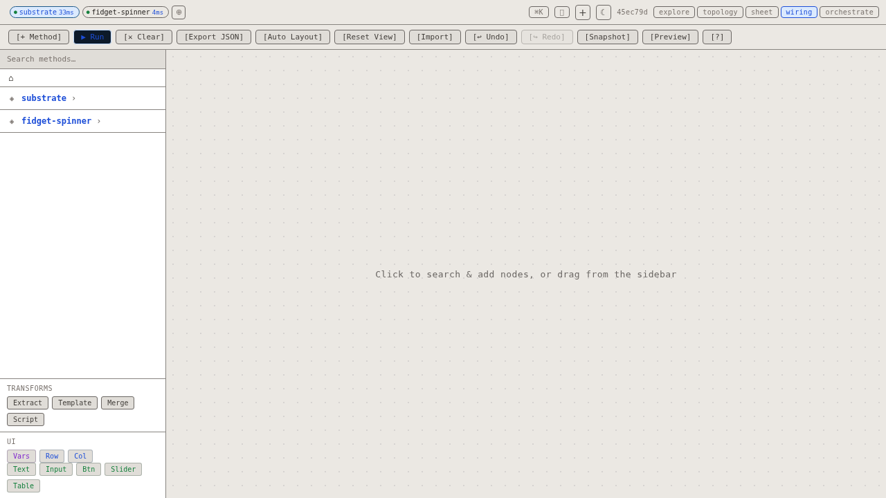

The canvas is fully empty. Placeholder text *"Click to search & add nodes, or drag from the sidebar"* centered on the dotted grid. The toolbar and sidebar node-kind buttons (Extract, Template, Merge, Script; Vars, Row, Col, Text, Input, Btn, Slider, Table) are all visible. `wiring.clear` worked correctly.

---

### wiring-transforms-all.png

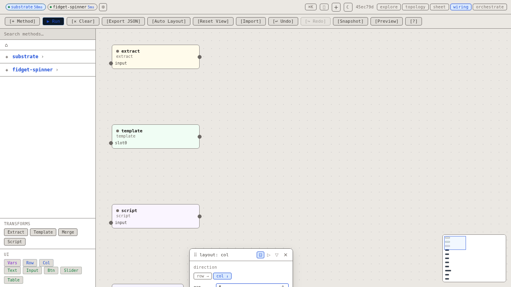

Three transform nodes visible on the canvas stacked vertically: `extract` (input port), `template` (slot0 port), and `script` (input port). A detail panel shows configuration for a `layout: col` node. A vertical list panel is visible on the far right. This demonstrates adding multiple distinct transform kinds via `wiring.addTransform` — extract, template, script, vars, widget (text/input/button/slider/table), and layout (row/col) were all added, though only three are in frame after auto-layout.

---

## Orchestration

### orch-create.png

A newly created untitled workflow. Title field shows "Workflow name..." placeholder. Sidebar shows "0 steps" with a green play button. Main canvas: *"No steps yet. Click + Add step to begin."*

---

### orch-rename.png

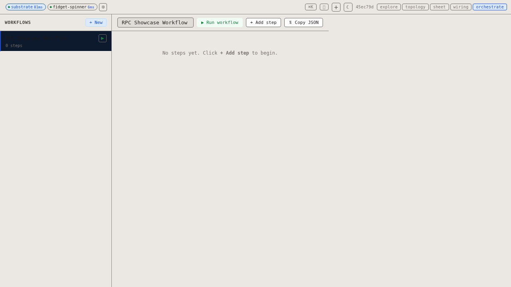

The title field now reads **"RPC Showcase Workflow"**. Otherwise identical to `orch-create.png`. Clear visual confirmation of `orchestration.rename`.

---

### orch-add-step-1.png

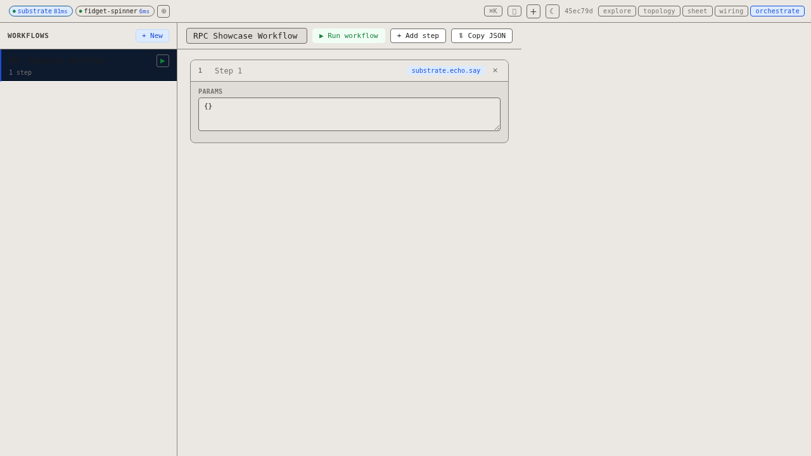

Sidebar updates to "1 step". Canvas shows a **Step 1** card with `substrate.echo.say` as the method (rendered in blue) and empty `{}` PARAMS. The empty-state message has been replaced by the step card.

---

### orch-add-step-2.png

Sidebar shows "2 steps". Canvas shows Step 1 and Step 2 cards stacked vertically, connected by a thin vertical line. Step 2 has the same method and a `+ add wire` button below. The connecting line makes the sequential dependency explicit.

---

### orch-set-params.png

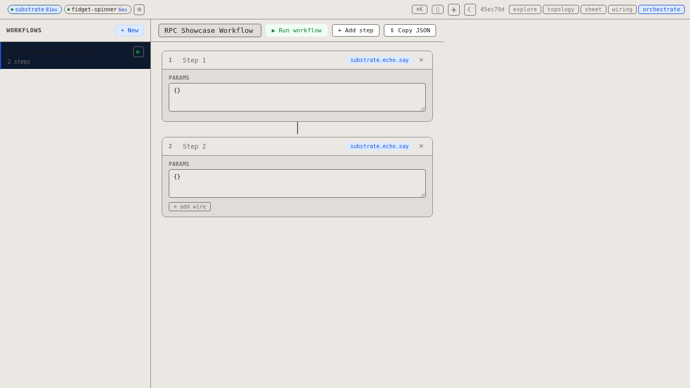

Step 2's PARAMS section shows a **WIRES** subsection with `message → step1.result` in orange text. Step 2's `message` parameter will receive `step1.result` at runtime. `orchestration.wireSteps` reflected correctly.

---

### orch-wire.png

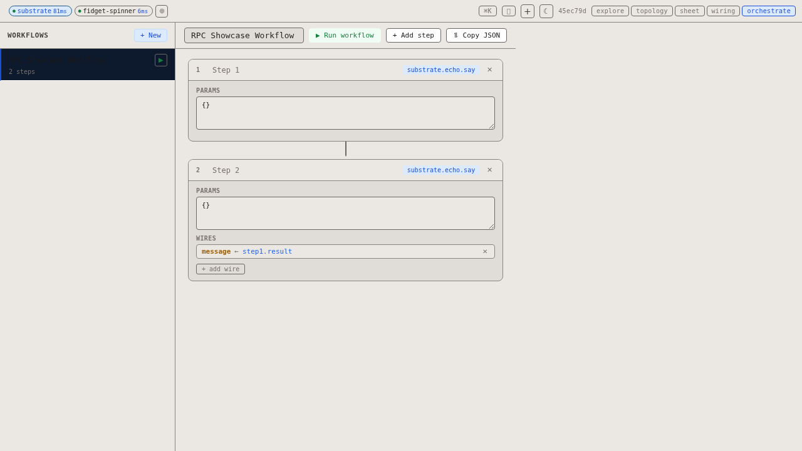

**🐛 Error state.** Step 1 has a red/pink border and *"error RPC error -32603: Internal error"*. The sidebar shows a red `fail` badge on Step 1 and `pending` on Step 2. Same root cause as `wiring-run.png` — `substrate.echo.say` does not exist.

---

### orch-run.png

**No change.** Identical to `orch-wire.png`. `orchestration.run` had already been called; this duplicate capture shows no additional transition.

---

### orch-state.png

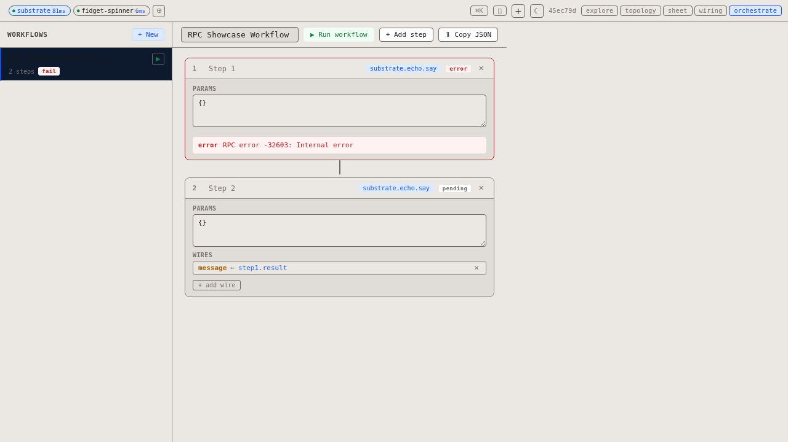

**No change.** `orchestration.getState` is query-only. The failed state from the previous screenshots is unchanged.

---

## Replay

### replay-list.png

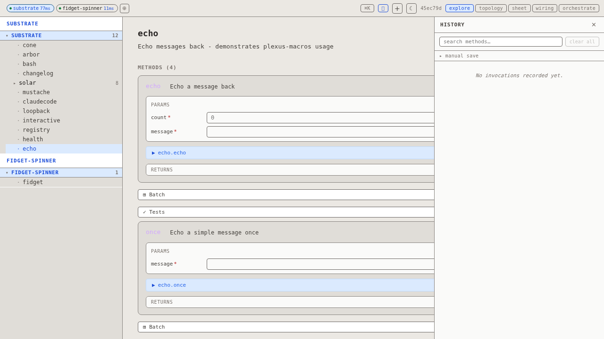

**🐛 Empty history.** The HISTORY panel shows *"No invocations recorded yet."* The test attempted to seed history by clicking `.invoke-btn` in the UI, but that path appears not to have executed or recorded an entry. `replay.list` returned an empty array.

---

### replay-clear.png

**No visible change.** `replay.clear` was called but history was already empty, so nothing changed visually.

---

## Assertions

### assertion-add.png

Small icon buttons (copy/test controls) have appeared in the top-right corners of each method section (`echo.echo`, `echo.once`). These indicate the assertion suite is active and `assertion.addTest` registered the test case. The HISTORY panel on the right has been replaced by the assertion suite UI.

---

### assertion-list.png

**No visible change.** `assertion.list` is query-only. Same display as `assertion-add.png`.

---

### assertion-run.png

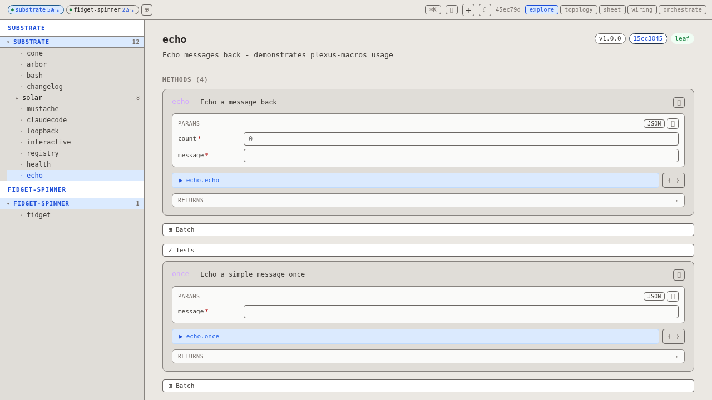

**No visible feedback.** `assertion.runTest` executed but no pass/fail badge, result indicator, or status message appeared in the captured frame. The assertion suite component does not currently render run results visually in the method explorer.

---

### assertion-runall.png

**No visible feedback.** Same as `assertion-run.png`. `assertion.runAll` returned `{ ok: true, count: 1 }` but produced no visible UI update.
